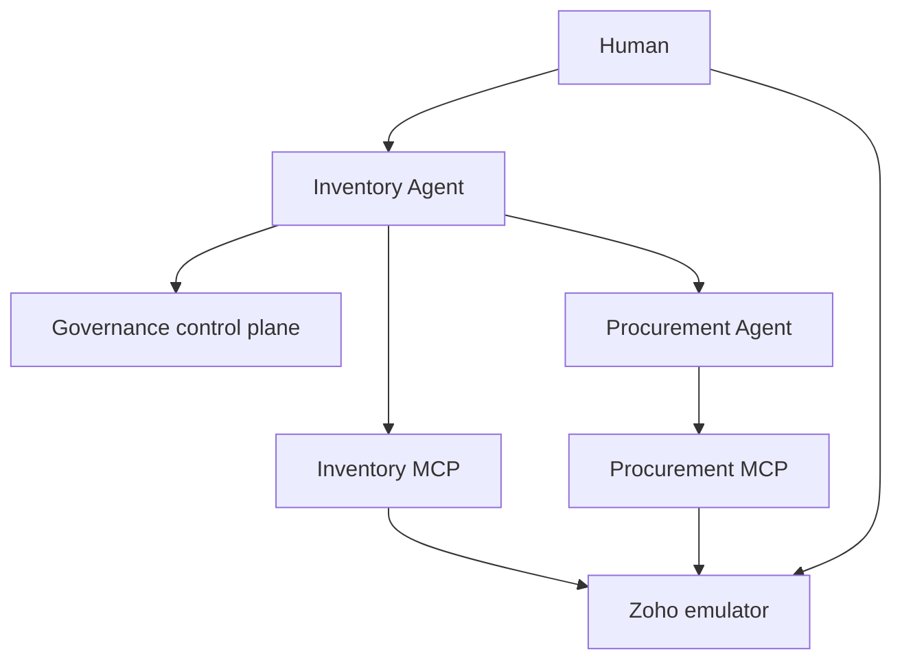
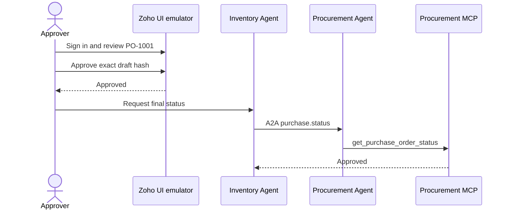

# Architecture

## Three independent identities

| Identity | Auth mechanism | Used for |
|---|---|---|
| Human requester/approver | Human access token or Zoho UI session | Initiate request; approve exact PO draft |
| Inventory/Procurement Agent | Signed workload credential plus delegated JWT | A2A and MCP authorization |
| Zoho connector | OAuth client + refresh token -> access token | SaaS API access |

An Agent Identity does not replace Zoho OAuth, and neither proves human approval.

## Component view



The control plane groups Registry, Identity Broker, and Gateway for readability. All A2A and MCP traffic passes through the Gateway.

## Authenticated business sequence

```mermaid
sequenceDiagram
    actor Human
    participant IA as Inventory Agent
    participant IM as Inventory MCP
    participant PA as Procurement Agent
    participant PM as Procurement MCP
    Human->>IA: Replenish SKU + human token
    IA->>IM: get_inventory + delegated token
    IM-->>IA: 27 on hand; threshold 50
    IA->>PA: A2A purchase.request + delegated token
    PA->>PM: create_purchase_order_draft
    PM-->>PA: PO-1001 pending approval
    PA-->>IA: A2A artifact + draft hash
    IA-->>Human: Review required
```



## Delegated token model

| Hop | `sub` | `aud` | Current `act` | Scope |
|---|---|---|---|---|
| Human -> Inventory Agent | `demo-user` | `inventory-agent` | — | `assistant.inventory` |
| Inventory Agent -> Inventory MCP | `demo-user` | `zoho-inventory-mcp` | `inventory-agent` | `inventory.read` |
| Inventory Agent -> Procurement Agent | `demo-user` | `procurement-agent` | `inventory-agent` | `purchase.request` |
| Procurement Agent -> Procurement MCP | `demo-user` | `zoho-procurement-mcp` | `procurement-agent` nested over `inventory-agent` | `purchaseorder.create` |

The MCP connector then exchanges its own dedicated Zoho refresh token for an opaque Zoho access token. The human/agent JWT is never forwarded to Zoho, and the Zoho token is never returned to an agent.

## Authorization invariant

$$
\text{allowed call}=\text{registered target}\cap\text{authenticated actor}\cap\text{audience}\cap\text{route policy}\cap\text{scope}
$$

Approval adds a separate invariant: authenticated approver, pending state, and exact draft-hash match.
