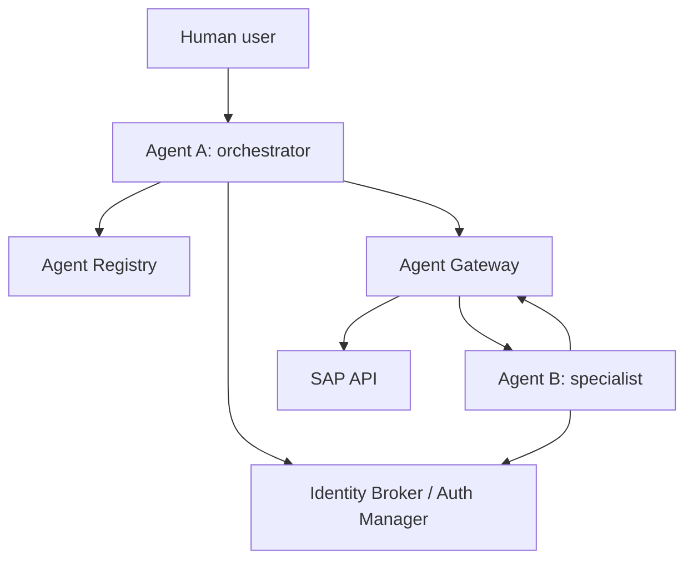

# Architecture

## Component view



The Registry answers **what exists**. Identity answers **who is calling**. Authorization policy answers **what that identity may do**. The Gateway is an enforcement point. Auth Manager exchanges credentials without giving an agent the user's reusable credential. A2A defines the inter-agent application message.

## End-to-end sequence

```mermaid
sequenceDiagram
    actor User
    participant A as Agent A
    participant R as Registry
    participant I as Identity Broker
    participant G as Gateway
    participant B as Agent B
    participant S as SAP
    User->>I: Sign in; receive T1
    User->>A: Request + T1
    A->>I: Authenticate as Agent A
    A->>R: Discover Agent B
    A->>I: Exchange T1 + Agent A proof for T2
    A->>G: A2A message/send + T2
    G->>B: Authorized A2A request
    B->>I: Exchange T2 + Agent B proof for T3
    B->>G: SAP request + T3
    G->>S: Authorized records.read
    S-->>User: Inventory result through B and A
```

## Token model

| Token | Subject (`sub`) | Audience (`aud`) | Actor (`act`) | Scope | Meaning |
|---|---|---|---|---|---|
| T1 | `demo-user` | `agent-a` | — | `assistant.inventory` | Human may invoke Agent A |
| T2 | `demo-user` | `agent-b` | `agent-a` | `inventory.read` | Agent A acts for the human toward Agent B |
| T3 | `demo-user` | `sap-api` | `agent-b -> agent-a` | `records.read` | Agent B, called by A, acts for the human toward SAP |

Every token is short-lived, signed with RS256, audience-bound, and scope-bound. The nested `act` claim preserves the workload delegation chain. This is a teaching implementation inspired by OAuth 2.0 Token Exchange; it is not a Google token service.

## Policy equation

The supplied governance material states the protected backend succeeds only when its moving parts align. This demo makes that executable:

$$
\text{SAP success} = \text{registered target} \cap \text{authenticated actor} \cap \text{allowed route} \cap \text{valid delegated token} \cap \text{required scope}
$$

Removing any term produces a denial and an audit event.
